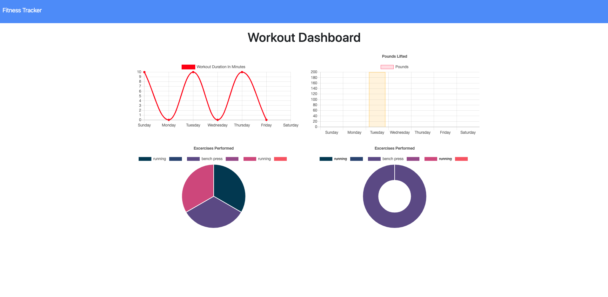
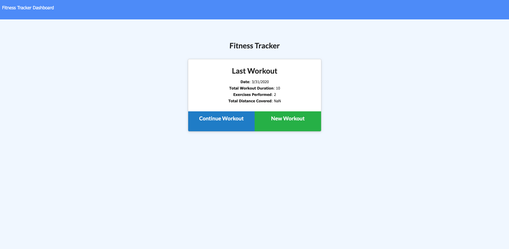
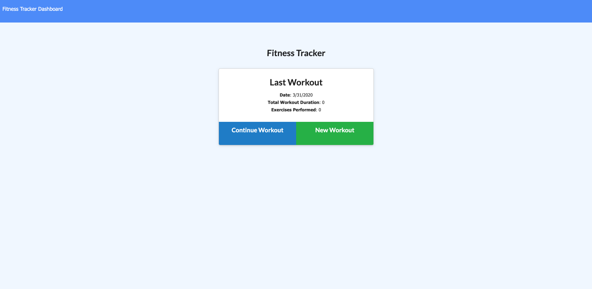

# Fitness Tracker
Fitness tracker that uses mongoose, express, & mongodb.  You input either cardio or resistence and it saves to a database. It tracks your progress through the week.

##  Links
Git Hub Repository
https://github.com/rythomas2525/17fitnesstracker
Heroku Deployed
https://shrouded-gorge-78520.herokuapp.com/?id=5e8367ec2f62b600176fe036
Portfolio
https://ryanlthomas.com

## GIF

## Developed by Ryan Thomas
